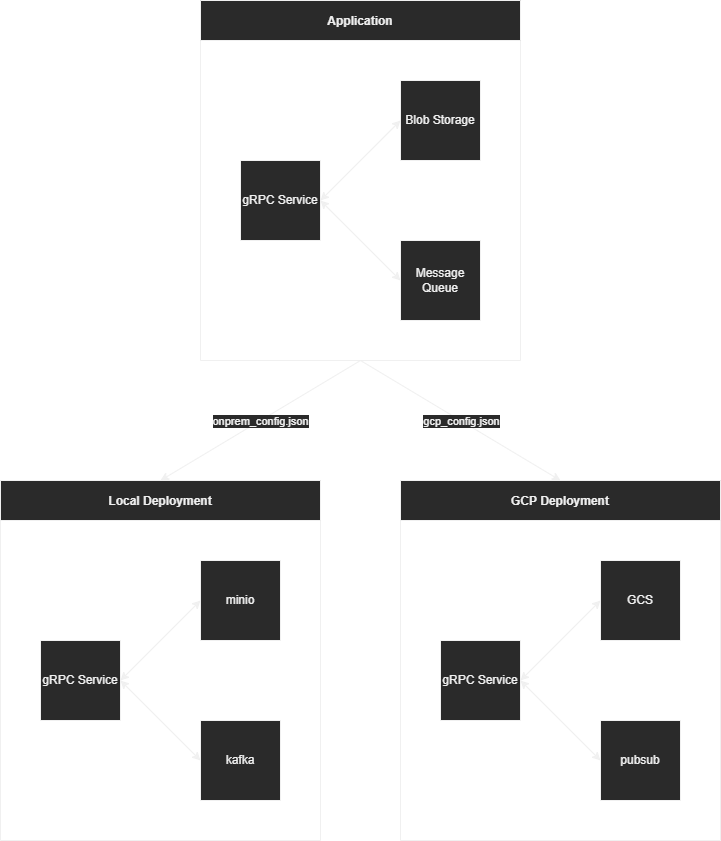

# Lariat Data Platform

Data processing platform

## About

The goal of this project is to create a cloud-agnostic framework for 
data intensive applications. By providing a high-level abstraction for 
commonly used resources such as message queues, blob storage, and 
databases, this framework allows application logic to be completely
decoupled from the environment in which it is deployed.

A secondary goal of this project is to provide a free and open basis 
for developing enterprise services. It is common for companies to 
produce code that is outdated, proprietary, and tightly coupled with 
the environment in which is is deployed, as they are driven by the 
requirements of their customers. Lariat intends to take the opposite 
approach, by providing building blocks for enterprise services that 
are battle tested across environments, and driven by the needs of the 
developers who use them.

## Design

Each abstract resource receives receives its concrete implementation 
from a set of plugins, which are determined at runtime based on the 
configuration file. As a result, the core library is only responsible 
for loading configuration files and managing plugins. This approach 
allows deployments to remain compact, as they only need to ship with 
the plugin libraries that they actually use.

For example, a service that stored uploaded documents and notifies 
other services via a message queue may use the following architecture:

By using the `onprem_config.json` and `gcp_config.json`, the same 
code can be deployed locally and in Google Cloud, respectively. Each 
plugin is written to conform to the specifications for each abstract 
resource, so an application that works in one environment should work 
in another, assuming resources have been provisioned correctly. In 
addition to simplifying the migration process, the cost of mantaining 
cloud resources for testing purposes can be reduced.

## Licensing

While the runtime is MIT license, plugins licensed separately. This 
allows the plugins to comply with the licensing requirements of their 
dependencies. All plugins are loaded dynamically, so this works with 
almost any license type, including GPL. Plugins can be licensed under 
the individual or organization that added them, provided that it does 
not break compliance in the larger platform.